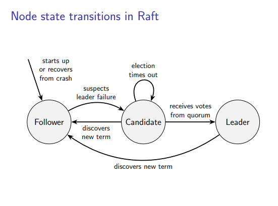

# [Kleppmann Raft Lecture](https://www.youtube.com/watch?v=uXEYuDwm7e4)
Notes: https://www.cl.cam.ac.uk/teaching/2122/ConcDisSys/dist-sys-notes.pdf (page 60)




## slide (1/9) Initialization
```rs
fn Initialize(self: Node) {
    // *** STABLE ***
    self.current_term = 0;
    self.voted_for = None;
    self.log = [];
    self.commit_length = 0;

    // memory
    self.current_role = Follower;
    self.current_leader = None;
    self.votes_received = {};
    self.sent_length = map<NodeID, int>();
    self.acked_length = map<NodeID, int>();
}

fn Recover(self: Node) {
    // stable variables recovered from storage

    self.current_role = Follower;
    self.current_leader = None;
    self.votes_received = set<NodeID>();
    self.sent_length = map<NodeID, int>();
    self.acked_length = map<NodeID, int>();
}

// need some timer for leader failure?
// time since last message from leader?
fn OnLeaderFailedOrElectionTimeout(self: Node) {
    // become candidate, vote for self
    self.current_term += 1;
    self.current_role = Candidate;
    self.vote_for = self.id;
    self.votes_received = {self.id};
    
    let last_term = 0;
    if self.log.len() > 0 {
        last_term = self.log.last().term;
    }

    // request votes from peers
    for node in nodes { // other than self?
        SEND(node, VoteRequest {self.id, self.current_term, self.log.len(), last_term} );
    }

    // TODO:
    START(election_timer());
}
```

## Slide (2/9) Voting for peers
```rs
fn OnReceiveVoteRequest(self: Node, VoteRequest) {
    // if we see a higher term, step down, reset vote
    if VoteRequest.term > self.current_term {
        self.current_term = VoteRequest.term;
        self.current_role = Follower;
        self.vote_for = None;
    }

    // determine the last term in our log
    let last_term = 0;
    if self.log.len() > 0 {
        last_term = self.log.last().term;
    }

    // determine if the requesters log is healthy (higher term, or same term and >= length)
    let log_ok = (VoteRequest.last_log_term > last_term) || 
                (VoteRequest.last_log_term == last_term && VoteRequest.log_length >= self.log.len());

    // if requesters term is current, log is healthy, and we haven't voted
    if VoteRequest.term == self.current_term && log_ok && self.vote_for == None {
        // vote yes
        vote_for = Some(VoteRequest.node);
        SEND(VoteRequest.node,  VoteResponse {self.node, self.current_term, true} );

    } else {
        // vote no
        SEND(VoteRequest.node, VoteResponse {self.node, self.current_term, false} );

    }
}
```

## slide (3/9) Collecting votes
```rs
fn OnReceiveVoteResponse(self: Node, VoteResponse) {

    // if we are still a candidate, the response is for the current term, and vote was granted
    if self.current_role == Candidate && VoteResponse.term == self.current_term && VoteResponse.granted {
        self.votes_received.add(VoteResponse.voter);
        
        // check if we have received quorum 
        if self.votes_received.len() >= (nodes.len() + 1) / 2 {
            self.current_role = Leader;
            self.current_leader = self.id;
            STOP(election_timer());

            // replicate logs to other nodes
            for follower in nodes exclude self { // other than self
                self.sent_length[follower] = self.log.len();
                self.acked_length[follower] = 0;
                REPLICATE_LOG(self.id, follower);
            }
        }
    } else if VoteResponse.term > self.current_term {
        // if we see a higher term, step down as usual
        self.current_term = VoteResponse.term;
        self.current_role = Follower;
        self.voted_for = None;
        STOP(election_timer())
    }
}
```

## slide (4/9) Broadcasting Messages

```rs
// request from client
fn OnBroadcastRequest(self: Node, msg) {
    // if we are leader, append to log, forward to followers
    if self.current_role == Leader {
        
        self.log.append(LogEntry {msg, self.current_term});
        self.acked_length[self.id] = self.log.len();

        for follower in nodes exclude self {
            REPLICATE_LOG(self.id, follower);
        }
    } else {
        // else, forward to leader via FIFO link (?)
        // my understanding: if we receive many broadcasts 
        // at once, we must forward them in order that we receive them.
        // But do we care about order we send, or order we receive?
        FORWARD(self.current_leader, msg);
    }
}

// must occur on interval
fn OnHeartbeatInterval(self: Node) {
    // acts as leader heartbeat, ensures re-delivery of missed logs
    if self.current_role == Leader {
        for follower in nodes other than self {
            REPLICATE_LOG(self.id, follower);
        }
    }
}
```

## slide (5/9) Replicating from leader to followers
```rs
fn REPLICATE_LOG(self: Node, leader_id, follower_id) {
    // prefix: all log entries we think we have sent to follower
    let prefix_len = self.sent_length[follower_id];

    // suffix: all log entries we have not yet sent to the follower
    let suffix = log[prefix_length..];

    // term of last entry in prefix
    let prefix_term = 0;
    if prefix_len > 0 {
        prefix_term = self.log[prefix_len - 1].term;
    }

    SEND(follower_id, LogRequest {leader_id, self.current_term, prefix_len, prefix_term, self.commit_length, suffix});
}
```

## slide (6/9) Followers receiving messages

```rs
fn OnLogRequestReceived(self: Node, LogRequest) {

    // step down if we see a higher term
    if LogRequest.term > self.current_term {
        self.current_term = LogRequest.term;
        self.voted_for = None;
        STOP(election_timer());
    }

    // above, we accepted current_term = term, so we always 
    // fall through to this if-statement as well if 
    // the first executed 
    if LogRequest.term == self.current_term {
        self.current_role = Follower;
        self.current_leader = LogRequest.leader_id;
    }

    // check that we have the prefix that the sender is assuming we have
    // (or longer).
    // AND
    // prefix length is 0 
    //      OR last log term in prefix on follower = last log term on leader
    // 
    // this maintains raft invariant:
    //
    // if 2 nodes have the same log entry at a certain index, particularly term,
    // entire log up to and including that index will be identical.
    // including term on the entry is essentially an efficient check that the
    // entries are the same, only way they could be different is if they are 
    // from different terms
    let log_ok = (self.log.len() >= LogRequest.prefix_len) 
        && (LogRequest.prefix_length == 0 
            || self.log[LogRequest.prefix_length - 1].term == LogRequest.prefix_term);


    if LogRequest.term == self.current_term && log_ok {
        APPEND_ENTRIES(LogRequest.prefix_length, LogRequest.leader_commit, LogRequest.suffix);
        let ack = LogRequest.prefix_length + LogRequest.suffix.length;
        SEND(LogRequest.sender, LogResponse {self.id, self.current_term, ack, true} );
    } else {
        SEND(LogRequest.sender, LogResponse {self.id, self.current_term, 0, false} );
    }
}
```

## slide (7/9) updating follower's logs
```rs
fn APPEND_ENTRIES(self: Node, prefix_len, leader_commit, suffix) {

    // check if we have anything to append
    if suffix.len() > 0 && self.log.len() > prefix_len {
        // last log entry we can compare between follower state and leader state.
        let index = min(self.log.len(), prefix_len + suffix.len()) - 1;

        // compare term numbers, if not same, we have an inconsistency.
        // must truncate the log where they diverge. 
        // this is fine because they are not committed. 
        if self.log[index].term != suffix[index - prefix_len].term {
            self.log = self.log[..prefix_len - 1];
        }
    }

    // append new log entries to the log
    if prefix_len + suffix.len() > self.log.len() {
        for i in self.log.len() - prefix_len..suffix.len() - 1 {
            self.log.append(suffix[i]);
        }
    }

    // after we have updated the log, we can commit the logs
    // that the follower has also already committed
    if leader_commit > self.commit_length {
        for i in self.commit_length..leader_commit - 1 {
            self.state.apply_command(log[i].command);
        }

        self.commit_length = leader_commit;
    }
}
```

## slide (8/9) Leader receiving log acknowledgements
```rs
fn OnReceiveLogResponse(self: Node, LogResponse) {
    if LogResponse.term == self.current_term && self.current_role == Leader {
        // ensures ack > last ack, incase response re-ordered
        if LogResponse.success && ack >= self.acked_length[LogResponse.sender] {
            self.sent_length[LogResponse.sender] = LogResponse.ack;
            self.acked_length[LogResponse.sender] = LogResponse.ack;
            COMMIT_LOG_ENTRIES();

        } else if self.sent_length[LogResponse.sender] > 0 {
            // if send fails, maybe gap in follower log.
            // decrement to try and shrink prefix, sending one more log
            // on next attempt.
            // if gap is large, this could take many iterations. (can be optimized)
            self.sent_length[LogResponse.sender] -= 1;
            REPLICATE_LOG(self.id, LogResponse.sender);
        }
        
    } else if LogResponse.term > self.current_term {
        // as usual, step down if we see higher term
        self.current_term = LogResponse.term;
        self.current_role = Follower;
        self.voted_for = None;
        STOP(election_timer());
    }
}
```

## slide (9/9) leader committing log entries

```rs
fn COMMIT_LOG_ENTRIES(self: Node) {
    while self.commit_length < self.log.len() {
        // count acks for log entry
        let acks = 0;
        for node in nodes {
            if self.acked_length[node] > self.commit_length {
                acks += 1;
            }
        }

        // if a quorum of nodes have acked
        if acks >= (nodes.len + 1) / 2 {
            self.state.apply_command(self.log[self.commit_length].command);
            self.commit_length += 1;
        } else {
            break;
        }
    }
}
```


# Summary:

Role of Follower:
- Check for heartbeat of leader
    - if we haven't see it for T:
        - **Transition to Candidate**
- process messages

Role of Candidate
- request votes
    - if we receive quorum
        - **Transition to Leader**
    - if we timeout
        - increment term
        - **Transition to Candidate**
- process messages
    - if we discover new term
        - **Transition to Follower**

Role of Leader
    - send heartbeat
    - process messages
        - if we discover new term
            - **Transition to Follower**


